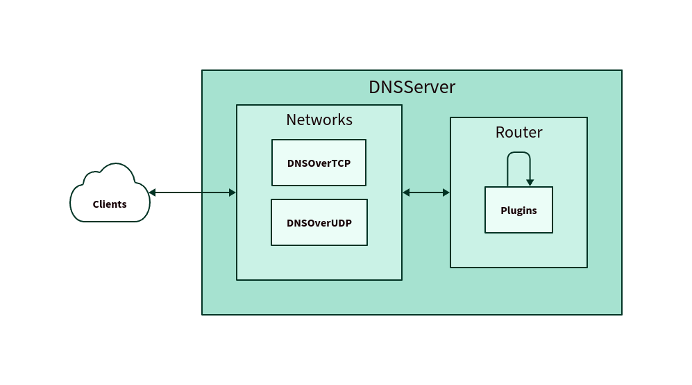

The `DefaultServer` is the main underlying class that's responsible for coordinating messages from the networks, constructing the plugin chain for incoming queries, and routing responses back to the client.

In its most basic form, the DefaultServer consists of just one or more networks and a simple plugin chain, as depicted below:



## Usage

The `DefaultServer`'s only required parameter is an array of networks. However, you can also optionally provide a `defaultHandler` which will be executed if the server reaches the end of the plugin chain and no response has been generated, as well as a custom `Router` if the default router doesn't suit your needs.

```ts
new DefaultServer({
    networks,
    defaultHandler: (req, res, next) => {
        res.errors.nxDomain();
    }
});
```

## Multithreaded Support

`DefaultServer` also has support for multithreading via [Node.js's cluster mode](https://nodejs.org/api/cluster.html).

To enable multithreading, simply pass in the boolean `multithreaded` parameter to the constructor of the `DefaultServer` class.

```ts title="multithreading.ts"
new DefaultServer({
    networks,
    multithreaded: true,
});
```
:::warning
Multithreading may not work properly with all plugins. Cluster mode recreates the server in each thread and load balances between them, so each thread will have its own copy of the server and its own local state. As such, workloads that depend on changing record sets should rely on external storage plugins like the [Redis store plugin](https://github.com/jafayer/dinodns-redis-storage).
:::
